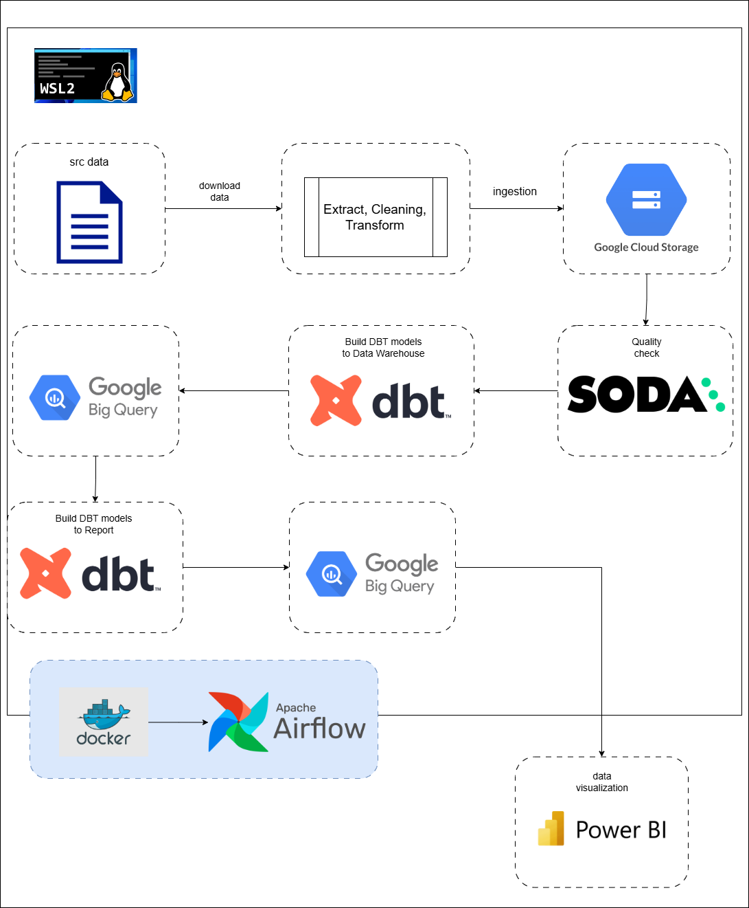
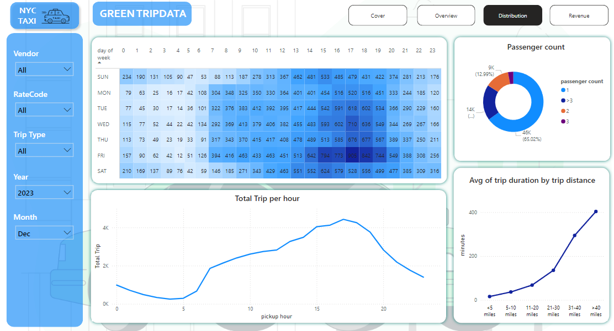

# Build Data Warehouse and Dashboard Analytics for NYC Taxi Green Trip Data

Overview
This project is a demo for building an end-to-end data pipeline that encompasses data modeling, data quality checks, and data visualization. The pipeline leverages several popular tools in the data ecosystem, including Apache Airflow, DBT, Soda, Google Cloud Storage, Google BigQuery and Power BI to provide a structured data flow from raw data to the final dashboard.

Tools :
1. Apache Airflow : Manages the end-to-end orchestration of the pipeline
2. Soda: Performs data quality checks at various stages of the pipeline
3. DBT (Data Build Tool): Transforms data and creates data models
4. Power BI: Visualizes the final processed data
5. Google Cloud Platform (Google Cloud Storage and Google BigQuery)
6. Docker

Workflow



- Create a service account in your GCP project, download the key file, and save it in the project directory (e.g., include/.gcp)
- Copy the API key ID and API key secret for Soda Cloud, and paste them into include/soda/configuration.yml
- build container:
    ```
    docker-compose build up -d
    ```
    Note: Ensure that the values for GCP_PROJECT_ID and GCP_GCS_BUCKET are correctly filled with the appropriate Project ID and bucket name. Similarly, for the volume, ensure that the directory path is correct.

    

- download file for green tripdata and zone lookup
- ingest data to raw folder on GCS
    Note: Ensure that you have created both the "raw" and "transform" folders.
- create dbt_project.yml: defines the project's name, version, and description, which helps identify the project and its dependencies. Specifies default configurations for models, such as materializations (e.g., view, table, incremental), schema, and database.
- create profiles.yml: this file is used to define connection settings to your data warehouse or database. It specifies how dbt should connect to the target database, including credentials, host, port, and other relevant configurations.
- create packages.yml
- create dbt/models/sources/sources.yml: this file is used to define source tables from your data warehouse or database. 
- create dbt/models/transform: this file is used to define your models


DBT
Running manually:
1. Enter the Airflow container
    ```
    docker exec -it <container_id> /bin/bash
    ```
2. Activate the dbt_venv
    ```
    source dbt_venv/bin/activate
    ```
3. Navigate to your dbt project
    ```
    cd include/dbt
    ```
4. Update the package
    ```
    dbt deps
    ```
5. Run dbt models
    ```
    dbt run --profiles-dir /opt/airflow/include/dbt/
    ```
    

6. Test dbt models
    ```
    dbt test --profiles-dir /opt/airflow/include/dbt/
    ```
    Note: Ensure the schema.yml has been created

    

7. Generate docs
    ```
    dbt docs generate
    ```
    

8. DBT docs serve: This command starts a webserver on port 8080 to serve your documentation locally and opens the documentation site in your default browser.
    ```
    dbt docs serve --port 8001 --host 0.0.0.0
    ```
    

Google BigQuery


Power BI

- Overview


- Distribution


- Revenue
